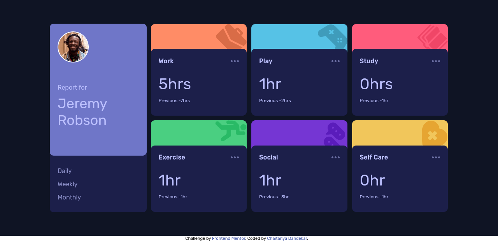
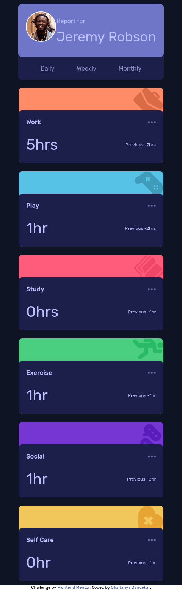

# Frontend Mentor - Time tracking dashboard solution

This is a solution to the [Time tracking dashboard challenge on Frontend Mentor](https://www.frontendmentor.io/challenges/time-tracking-dashboard-UIQ7167Jw). Frontend Mentor challenges help you improve your coding skills by building realistic projects. 

## Table of contents

- [Overview](#overview)
  - [The challenge](#the-challenge)
  - [Screenshot](#screenshot)
  - [Links](#links)
- [My process](#my-process)
  - [Built with](#built-with)
  - [What I learned](#what-i-learned)
  - [Continued development](#continued-development)
  - [Useful resources](#useful-resources)
- [Author](#author)
- [Development](#development)

## Overview

### The challenge

Users should be able to:

- View the optimal layout for the site depending on their device's screen size
- See hover states for all interactive elements on the page
- Switch between viewing Daily, Weekly, and Monthly stats

### Screenshot




### Links

- Solution URL: [Github](https://github.com/chaitanyadandekar/time-tracking-dashboard-hub-html-scss-js)
- Live Site URL: [Vercel](https://time-tracking-dashboard-hub.vercel.app)

## My process

### Built with

- Semantic HTML5 markup
- CSS using SCSS 
- Flexbox
- CSS Grid
- Mobile-first workflow

### What I learned

Throught the project I have made sure that I use semantic markups, but they have been used in only 1 or 2 places. This is my very first SCSS project and the experience was chaotic but enjoyable. Towards the end I really got to know the perks of SCSS over basic CSS syntax.

### Continued development

- Semantic HTML - Going to work on this alot.
- Explore SCSS - Future projects will inclue scss.
- JavaScript - Need to work on js and try to use its libraries.
- Backend - Try to include backend in upcoming projects.

### Useful resources

- [Coder Coder](https://www.youtube.com/channel/UCzNf0liwUzMN6_pixbQlMhQ) - This channel is reccomended to anyone starting projects. She covers live project building and is really helpful setting the enviornments.

- [w3schools](https://www.w3schools.com) - Amazing page which helped all aspects of projects.

## Author

- Frontend Mentor - [@chaitanyadandekar](https://www.frontendmentor.io/profile/chaitanyadandekar)

- LinkedIn - [Chaitanya Dandekar](https://www.linkedin.com/in/chaitanya-dandekar-060645205)

## Development

All the npm packages are Dev dependencies. You dont even need them while running your project. If you want to develop this project and customize it for your own needs then download them. The Gulp file Provided will help you set-up a live server.

- To download the dev packages go to the root directory (In which README.md is present in this case) and type in your console/shell/terminal:

```shell
foo@bar:~/../your_directory$ npm install --only=dev
```

- Make sure you have node and npm installed


